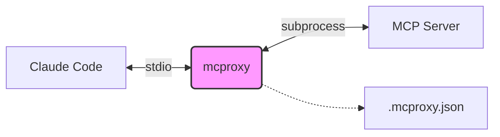

<div align="center">
  
  
  # mcproxy

  **MCP Proxy with Tool Filtering for Claude Code**
  
  Intercepts MCP server requests and filters tools based on configuration to reduce token consumption.

  [](LICENSE)
  [](https://www.npmjs.com/package/@team-attention/mcproxy)
  
  [Installation](#installation) • [Usage](#usage) • [Configuration](#configuration) • [How It Works](#how-it-works)
</div>

---

## 🚀 Installation

run directly with `npx` (recommended):

```bash
npx @team-attention/mcproxy <upstream-command>
```

Or install globally:

```bash
npm install -g @team-attention/mcproxy
```

## 🛠 Usage

### Basic Usage

Wrap your MCP server command with `mcproxy`:

```bash
mcproxy npx -y @modelcontextprotocol/server-filesystem /path/to/dir
```

### With Claude Code (.mcp.json)

Configure your `.mcp.json` to use `mcproxy` as a wrapper. This allows you to control which tools are exposed to Claude.

```json
{
  "mcpServers": {
    "filesystem": {
      "command": "npx",
      "args": [
        "-y", "@team-attention/mcproxy",
        "--",
        "npx", "-y", "@modelcontextprotocol/server-filesystem", "/path/to/dir"
      ]
    },
    "linear": {
      "command": "npx",
      "args": [
        "-y", "@team-attention/mcproxy",
        "--",
        "npx", "-y", "mcp-remote", "https://mcp.linear.app/mcp",
        "--header", "Authorization: Bearer ${LINEAR_API_KEY}"
      ]
    }
  }
}
```

## ⚙️ Configuration

`mcproxy` automatically creates a `.mcproxy.json` file in your workspace to manage tool settings.

```json
{
  "version": "1.0",
  "servers": {
    "linear-mcp@1.0.0": {
      "tools": {
        "list_issues": true,
        "create_issue": true,
        "delete_issue": false
      }
    }
  }
}
```

- **Auto-registration**: Tools are automatically added to the config on first use (default: `true`).
- **Disable Tools**: Set any tool to `false` to block it.
- **Server Identity**: Keys are derived from `serverInfo.name@version` in the MCP initialize response.

## 🧩 How It Works



1.  **Intercept**: `mcproxy` intercepts the MCP `initialize` response to identify the server.
2.  **Filter**: On `tools/list`, it filters out tools marked as `false` in `.mcproxy.json`.
3.  **Block**: On `tools/call`, it prevents execution of disabled tools.

## ⚡ Options

| Option            | Description                                                             |
| ----------------- | ----------------------------------------------------------------------- |
| `--config <path>` | Path to workspace root for `.mcproxy.json` (default: current directory) |

## 🐞 Debugging

Set `DEBUG=1` to enable verbose logging for troubleshooting:

```bash
DEBUG=1 mcproxy npx -y @some/mcp-server
```

## License

MIT
